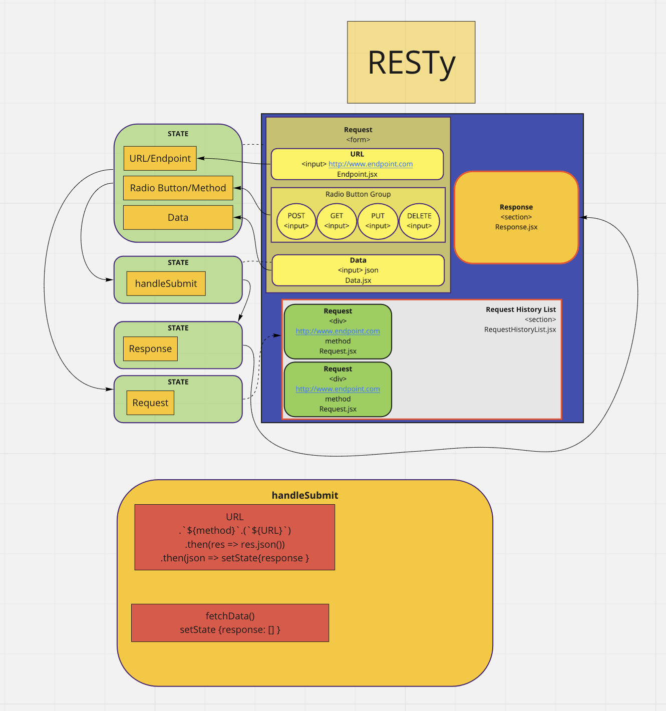

# RESTy

RESTy is a browser-based API server client that makes fetch requests to GET/POST/PUT/DELETE endpoints.

The endpoint is placed in the URL input. Radio buttons are used to select the method. JSON data is placed in the textarea.

When a fetch request is submitted, the response is displayed in the Response Field. Additionally, the method and URL of every fetch request is displayed in a history listing on the left. This history is refreshed whenever the window is refreshed.

